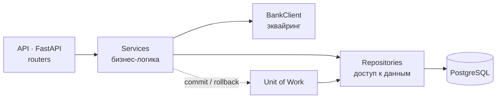

# Payments

[](../../actions)

Сервис оплаты заказов. Заказ можно закрыть одним платежом или десятью,
наличными или картой, часть денег вернуть — и в любой момент сказать, сколько
по заказу реально оплачено.

## Главное правило

Статус заказа никто не выставляет руками. Он выводится из суммы успешных
платежей и пересчитывается при каждом изменении:

| Оплачено | Статус заказа |
| --- | --- |
| ничего | `UNPAID` |
| часть суммы | `PARTIALLY_PAID` |
| вся сумма | `PAID` |

Поэтому расхождение «платежи говорят одно, статус — другое» здесь невозможно
в принципе, а не «не должно случаться».

Сам платёж живёт своей жизнью: `CREATED → PENDING → PAID`, плюс терминальные
`REFUNDED` и `FAILED`. Наличные (`CASH`) закрываются сразу, эквайринг
(`ACQUIRING`) уходит в `PENDING` и ждёт банк — и до подтверждения банком он
**не** попадает в `paid_amount`. При этом «зависший» эквайринг всё равно
занимает сумму заказа, иначе один и тот же заказ можно было бы оплатить дважды.

Возврат не удаляет платёж, а переводит его в `REFUNDED`: возврат — событие в
истории заказа, а не отсутствие платежа. Вернуть можно только оплаченный
платёж и только один раз.

## Слои



| Слой | Что делает | Где |
| --- | --- | --- |
| API | эндпоинты, коды ответов, валидация запроса | [`src/api`](src/api) |
| Сервисы | сценарии оплаты, возврата, сверки с банком | [`src/services`](src/services) |
| Репозитории | запросы к БД, никакой бизнес-логики | [`src/repos`](src/repos) |
| Интеграции | клиент банковского API | [`src/integrations/bank`](src/integrations/bank) |
| Домен | статусы, доменные исключения, константы | [`src/domain`](src/domain) |
| Модели и схемы | ORM SQLAlchemy 2 и Pydantic-схемы | [`src/models`](src/models), [`src/schemas`](src/schemas) |

Сервисы не трогают сессию напрямую: транзакцией управляет Unit of Work
([`src/db/uow.py`](src/db/uow.py)). Он открывает её на запрос и коммитит одним
куском — платёж и пересчитанный статус заказа сохраняются вместе либо не
сохраняются вовсе.

`BankClient` — имитация банка: проверяет входные данные и отвечает
правдоподобно, чтобы сценарии эквайринга проходились целиком без реального
провайдера. Контракт вынесен в
[`integrations/bank/schemas.py`](src/integrations/bank/schemas.py), так что живой
HTTP-клиент подставляется без правок сервисного слоя.

Схема БД — [`docs/database/diagram.png`](docs/database/diagram.png).

## Запуск

```bash
git clone https://github.com/SlavaKlkv/payments.git
cd payments
cp .env.example .env

docker compose up --build
```

Compose поднимает PostgreSQL 17, накатывает миграции Alembic и стартует
приложение. Swagger UI — <http://127.0.0.1:8000/docs>.

На хосте, без Docker:

```bash
curl -LsSf https://astral.sh/uv/install.sh | sh
uv sync
cp .env.local.example .env        # то же, но POSTGRES_HOST=localhost

uv run alembic upgrade head
uv run uvicorn src.main:app --reload --port 8000
```

Новая миграция после правки моделей:
`uv run alembic revision --autogenerate -m "..."`.

## Проверки

```bash
uv run pytest          # тесты
uv run ruff check .    # линтер
uv run mypy src        # типы
```

Тесты гоняются на in-memory SQLite, поэтому Postgres для них поднимать не
нужно. Покрыты сценарии оплаты (частичная, полная, несколько платежей,
переплата), эквайринга (ожидание банка, подтверждение, повторная сверка) и
возвратов (частичный, повторный, возврат неоплаченного). Те же проверки плюс
`ruff` и `mypy` гоняет [CI](.github/workflows/ci.yml) на каждый push и PR.

Чего тесты не проверяют: блокировку строки `SELECT … FOR UPDATE` — SQLite её
игнорирует. Для этого нужен Postgres, и это следующий шаг.

## Эндпоинты

| Метод | Путь | Что делает |
| --- | --- | --- |
| `POST` | `/api/orders/` | создать заказ |
| `GET` | `/api/orders/{order_id}` | заказ с текущим статусом оплаты |
| `POST` | `/api/payments/` | платёж по заказу: `CASH` или `ACQUIRING` |
| `POST` | `/api/payments/{payment_id}/refund` | возврат |
| `POST` | `/api/payments/{payment_id}/check` | спросить банк о статусе и синхронизировать |
| `GET` | `/health` | healthcheck |

```bash
# заказ на 1000
curl -sX POST http://127.0.0.1:8000/api/orders/ \
  -H 'Content-Type: application/json' \
  -d '{"total_amount": "1000.00"}'

# 400 наличными — заказ станет PARTIALLY_PAID
curl -sX POST http://127.0.0.1:8000/api/payments/ \
  -H 'Content-Type: application/json' \
  -d '{"order_id": 1, "amount": "400.00", "payment_type": "CASH"}'
```

Точные схемы запросов и ответов — в Swagger на `/docs`.

Стек: Python 3.13, FastAPI, SQLAlchemy 2 (async), Pydantic, Alembic,
PostgreSQL 17, uv, Docker Compose.

## Лицензия

MIT
