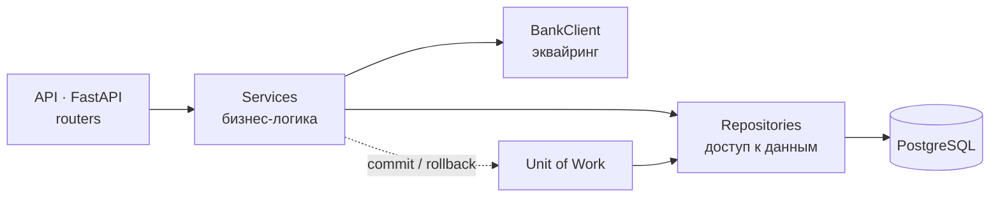

<div align="center">

# Payments

**Сервис платежей по заказу: несколько платежей на один заказ, наличные и эквайринг, возвраты.**

Статус оплаты заказа не выставляется руками — он пересчитывается из суммы успешных
платежей. Эквайринг ходит во внешнее банковское API, и состояние платежа
синхронизируется с тем, что ответил банк.

[](pyproject.toml)
[](src/api)
[](src/models)
[](docker-compose.yml)
[](#лицензия)

[Быстрый старт](#быстрый-старт) ·
[Как это устроено](#как-это-устроено) ·
[API](#api) ·
[Разработка](#разработка)

</div>

---

## Быстрый старт

```bash
git clone https://github.com/SlavaKlkv/payments.git
cd payments
cp .env.example .env

docker compose up --build
```

Compose поднимает PostgreSQL, накатывает миграции Alembic и запускает приложение.
Swagger UI — на <http://127.0.0.1:8000/docs>.

Локально, без Docker:

```bash
curl -LsSf https://astral.sh/uv/install.sh | sh
uv sync
cp .env.local.example .env          # тот же конфиг, но POSTGRES_HOST=localhost

uv run alembic upgrade head
uv run uvicorn src.main:app --reload --port 8000
```

---

## Как это устроено



| Слой | Что делает | Где |
| --- | --- | --- |
| **API** | REST-эндпоинты, коды ответов, валидация запроса | [`src/api`](src/api) |
| **Сервисы** | сценарии оплаты, возврата, сверки с банком | [`src/services`](src/services) |
| **Репозитории** | запросы к БД, никакой бизнес-логики | [`src/repos`](src/repos) |
| **Интеграции** | клиент банковского API для эквайринга | [`src/integrations/bank`](src/integrations/bank) |
| **Домен** | статусы, доменные исключения, константы | [`src/domain`](src/domain) |
| **Модели и схемы** | ORM SQLAlchemy 2 и Pydantic-схемы | [`src/models`](src/models), [`src/schemas`](src/schemas) |

**Транзакции — через Unit of Work.** Сервис не управляет сессией напрямую:
[`src/db/uow.py`](src/db/uow.py) открывает транзакцию на запрос и коммитит её
одним куском, поэтому платёж и пересчитанный статус заказа либо сохраняются
вместе, либо не сохраняются вовсе.

### Статусы

Статус заказа выводится из платежей, а не хранится как отдельное решение:

| Оплачено | Статус заказа |
| --- | --- |
| ничего | `UNPAID` |
| часть суммы | `PARTIALLY_PAID` |
| вся сумма | `PAID` |

Платёж живёт в своей цепочке: `CREATED → PENDING → PAID`, плюс терминальные
`REFUNDED` и `FAILED`. Наличные (`CASH`) закрываются сразу, эквайринг
(`ACQUIRING`) уходит в `PENDING` до подтверждения банком.

> [!NOTE]
> [`BankClient`](src/integrations/bank/client.py) — имитация банка: он проверяет
> входные данные и возвращает правдоподобные ответы, чтобы сценарии эквайринга
> можно было пройти целиком без реального провайдера. Контракт вынесен в
> [`schemas.py`](src/integrations/bank/schemas.py) — заменяется на живой HTTP-клиент
> без правок сервисного слоя.

Схема БД — [`docs/database/diagram.png`](docs/database/diagram.png).

---

## API

| Метод | Путь | Что делает |
| --- | --- | --- |
| `POST` | `/orders/` | создать заказ |
| `GET` | `/orders/{order_id}` | заказ с текущим статусом оплаты |
| `POST` | `/payments/` | платёж по заказу: `CASH` или `ACQUIRING` |
| `POST` | `/payments/{payment_id}/refund` | возврат платежа |
| `POST` | `/payments/{payment_id}/check` | спросить банк о статусе и синхронизировать его |

```bash
# заказ на 1000
curl -sX POST http://127.0.0.1:8000/orders/ \
  -H 'Content-Type: application/json' \
  -d '{"total_amount": "1000.00"}'

# частичная оплата наличными — заказ станет PARTIALLY_PAID
curl -sX POST http://127.0.0.1:8000/payments/ \
  -H 'Content-Type: application/json' \
  -d '{"order_id": 1, "amount": "400.00", "payment_type": "CASH"}'
```

Точные схемы запросов и ответов — в Swagger UI на `/docs`.

---

## Разработка

```bash
uv sync

# новая миграция после правки моделей
uv run alembic revision --autogenerate -m "add something"
uv run alembic upgrade head
```

Переменные окружения — в [`.env.example`](.env.example) (для Docker) и
[`.env.local.example`](.env.local.example) (для запуска на хосте). Реальные `.env`
в репозиторий не попадают.

---

## Лицензия

MIT
